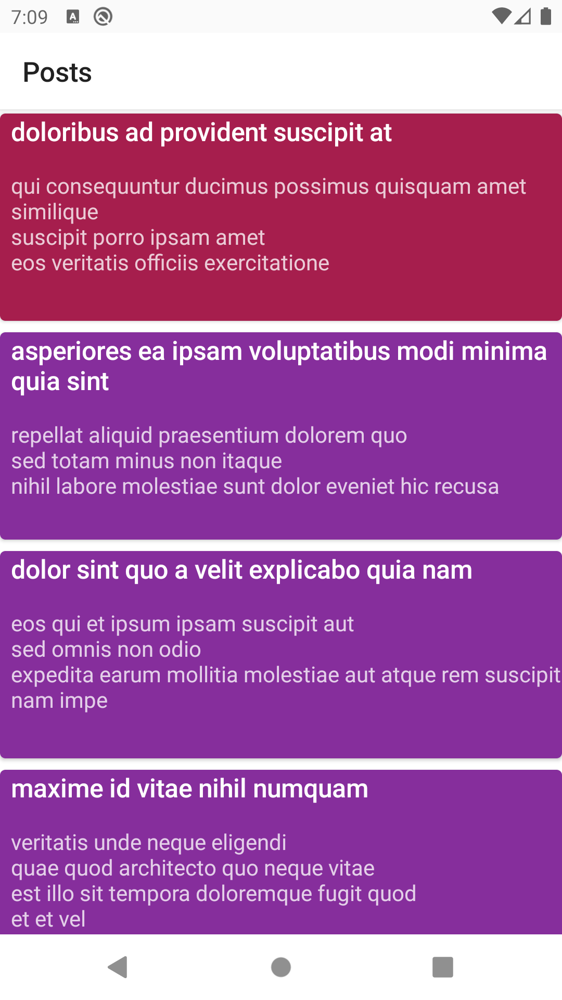
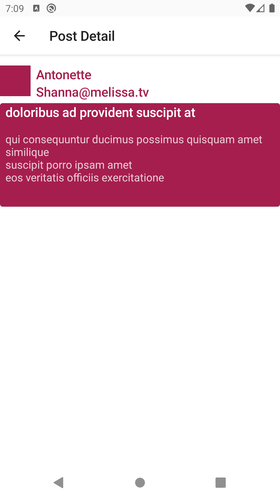

# HackerNews App

This project uses a minimal architecture due to the time limitation of the task and the overall simplicity of the feature-set. Some naming conventions are not _ideal_.

## Project notes

### Features

The project has two features (`posts` and `postDetail`) and for every feature, we have 4 files:
- `FeatureViewModel`: Coordinates how the state should be updated based on user actions and the backend response.
- `FeatureScreen`: A UI component that represents the feature's screen and handles the rendering of the state.
- `FeatureState`: A set of Data Classes and Sealed Classes which represent the UI state.
- `FeatureComponents`: The UI subcomponents related to that feature.

### DI

I decided to use Hilt for this project for its synergy with Jetpack Compose and Compose Navigation libraries. Most objects in the graph are scoped to the app, but we can still benefit from the aforementioned integrations to simplify things like view model injection.

## Main libraries used
- Jetpack Compose for UI
- Hilt for Dependency Injection
- Retrofit for the HTTP client

## Tests

You can find unit tests in the `./app/src/test/` folder.

### Testing with mock-web-server:

You can also use mockwebserver `docker` image to run _integration_ tests.

To do that you will need only 3 things:
- First, you'll need [docker](https://docs.docker.com/get-docker/) installed.
- Then, cd into `./mockwebserver-docker-img/` and run `docker compose up`
- And lastly, open `./gradle.properties` and change `USE_MOCK_URL` to `true`

To change the API response, just change the data in `./mockwebserver-docker-img/initializerJson.json`.

## Run

You can use the good old `gradle assebleDebug` to generate an APK or if you're in a hurry, you can [download this one](assets/app-debug.apk).

