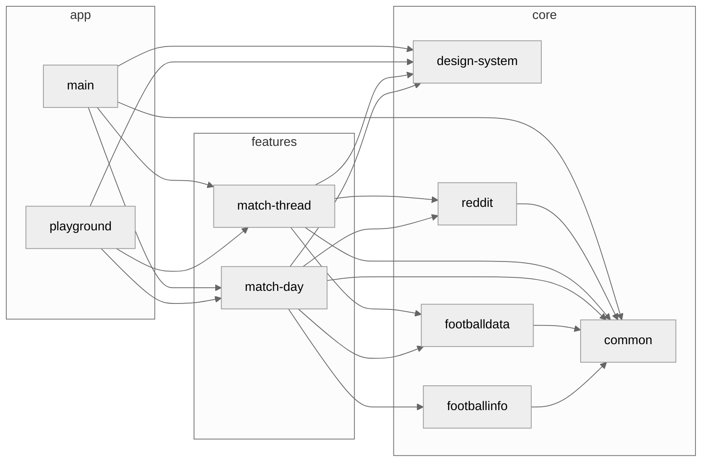

</img>

# Live Match

This is a POC of a client built specifically for Reddit's [/r/soccer](https://www.reddit.com/r/soccer/) community. The idea is that
you can use this app to follow any live match happening, besides you will be able to watch goals and other match related media as they're posted with a native video player (WIP).

**LiveMatch** is a fully functional Android where I try to apply some ideas and best practices related to android development while also explore new ideas that only a side project would allow. In this small
project you can see How I approach: modularization, dependency injection, unit testing, architecture, UI/UX design, etc.

# Features

The app has three main features:

* The Match Day feature lists all the football matches happening today and their scores.

* The Match Thread displays important information about a football match and the best comments from Reddit's `/r/soccer` community. These comments are organized based on what was happening in the match at the time they were posted.

- Match Highlights is a collection of all media related to the match thread that has been posted, displayed in a carousel. When tapped, they can be viewed by opening an in-app browser tab. The plan is to have an in-app video playback in the future.

## App Screens

| Feature      | Dark Theme                                                               | Light Theme                                                               |
|--------------|--------------------------------------------------------------------------|---------------------------------------------------------------------------|
| Match Day    |     |     |
| Match Thread |  |  |

# Architecture

**Important Note:** This example focuses on scalability and is suitable for large projects and teams. For smaller projects and teams, a simpler approach and architecture may be more appropriate. The goal of this project is to demonstrate how I would approach app architecture in big projects and teams to ensure scalability.

This architecture includes:

- A layered architecture approach inspired by hexagonal/clean-arch.

- Rail Oriented Programming across all layers.

- MVVM like Arch for the presentation layer, featuring unidirectional data flow.


# Modularization

This modularization approach is an example of how to scale a project for multiple developers. While it may have some simplifications compared to what you might see in a larger project with over 50 developers, it still attempts to showcases the key principles of what I consider `good` modularization. This approach strikes a balance between keeping things straightforward and ensuring scalability, making it a smart choice for a small project.

## Packaging approach

There is a debate about whether to package the code by feature or by layer. Both approaches have advantages and disadvantages. Packaging by feature groups together all the code needed to implement a specific feature, which makes it easier to understand and maintain. However, it can lead to code duplication and make it difficult to reuse code across features. Packaging by layer groups together code based on the function it performs, which makes it easier to reuse code and enforce consistency. However, it can make it harder to understand specific features and changes may affect multiple features.

Here, a hybrid approach was used.
I packaged the UI logic by feature, so all the code related to a specific feature was kept in the same package. However, for the services used in the project, we packaged them by layer, with data and domain kept in the same module. This enabled us to reuse the code across features, but without enforcing the creation of separate modules for each layer. Instead, we kept them as simple Java packages to keep the code base simpler. This approach allowed us to balance the advantages of both packaging by feature and packaging by layer, and resulted in a codebase that was both modular and easy-er to maintain.

## Modules

| Name                   | Responsibilities                                                                                                                    |
| ---------------------- | ----------------------------------------------------------------------------------------------------------------------------------- |
| `app:main`             | Defines the Application and MainActivity as the main entry point of the application.                                                |
| `app:playground`       | Enables testing of mocked screens, components, and navigation flows, making it easier to test and debug the application.            |
| `feature:match-day`    | Contains UI components and UI logic related to the MatchDay feature.                                                                |
| `feature:match-thread` | Contains UI components and UI logic related to the MatchThread feature.                                                             |
| `core:common`          | Contains network components and other shared components.                                                                            |
| `core:design-system`   | Contains shared UI elements used throughout the application.                                                                        |
| `core:reddit`          | Serves as a single source of truth for Reddit data and exposes repository abstractions and use cases related to Reddit.             |
| `core:footballdata`    | Serves as a single source of truth for Footballdata data and exposes repository abstractions and use cases related to Footballdata. |


### Dependency Diagram


# Testing with mock-web-server:

You can use mockwebserver `docker` image to run _integration_ tests.

To do that you will need only 3 things:

- First, you'll need [docker](https://docs.docker.com/get-docker/) installed.
- Then, cd into `./mockwebserver-docker-img/` and run `docker compose up`
- And lastly, open `./gradle.properties` and change `USE_MOCK_URL` to `true`

To change the API response, just change the data
in `./mockwebserver-docker-img/initializerJson.json`.

# Static Analysis

You can run `ktlintFormat` and `detektCheck` to check code style. CI is WIP.

# Building

You'll need to provide gradle properties to build it locally.

```bash
CLIENT_ID=# Your Reddit client id
FOOTBALL_KEY=# The API key for football-data.org
```
# Adding SVG icons

Add the desired svg icon file in `./assets/icons/svgs/` and then run:
```bash
$ kotlin svg-to-compose.main.kts
```
This will generate a file to programatically create that icon using the compose API and then place it in the `design-system` module, ready to be used.

# Acknowledgements

The LiveMatch App icon was created using
<a href="https://www.flaticon.com/free-icons/football" title="football icons">Football icons created by Freepik - Flaticon</a>

# TODO

- [x] Use match score from dedicated API
- [ ] Native video player
- [ ] Match Stats
- [ ] Github actions CI
- [ ] Match highlight comments
- [x] Light Theme
- [ ] Better match events ticker
- [ ] Reddit comment stream
